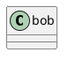

# Práctica FOTG {#title}
## Análisis {#subtitle}

### Requisitos {#field}

#### Funcionales {#subfield}
* Permitir al usuario registrarse e iniciar sesión en la aplicación.
* Permitir al usuario modificar su equipo.
* Permitir al usuario ver todos los personajes disponibles.

#### No funcionales {#subfield}
* Que la contraseña del usuario esté almacenadade forma cifrada para proveer seguridad.
* Interfaz agradable, adecuada y útil.

  

### Diagrama de Casos de Uso {#field}

  

<pre id="document-end">Iván Vicente Morales 2DAM</pre>