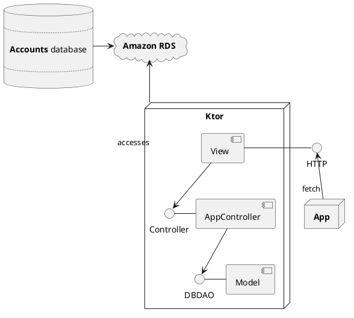
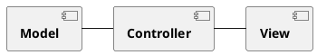
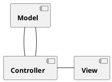
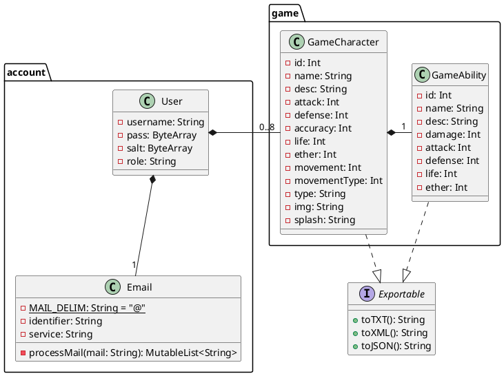

# Práctica FOTG {#title}
## Diseño {#subtitle}

### Software {#field}

#### Prototipo de las vistas - <code id="inline-code"><a href="https://www.figma.com">Figma</a></code> {#subfield}
#### Diseño de bases de datos (MER y MR) - <code id="inline-code"><a href="https://apps.microsoft.com/detail/microsoft-whiteboard/9MSPC6MP8FM4?hl=es-ES&gl=ES">Microsoft Whiteboard</a></code> {#subfield}

 

#### Implementación de bases de datos - <code id="inline-code"><a href="https://www.mysql.com">MySQL</a></code> {#subfield}
#### Hosting de la base de datos - <code id="inline-code"><a href="https://aws.amazon.com/es/rds/">Amazon RDS</a></code> {#subfield}
#### Implementación del servidor HTTP - <code id="inline-code"><a href="https://ktor.io">Ktor</a></code> con conectores JDBC. {#subfield}
#### Hosting del servidor - <code id="inline-code"><a href="https://render.com">Render</a></code> {#subfield}
#### Implementación de controladores de vista, controladores de aplicación y DAO - <code id="inline-code"><a href="https://kotlinlang.org">Kotlin</a></code> {#subfield}
#### Desarrollo de la aplicación móvil - <code id="inline-code"><a href="https://developer.android.com/studio?hl=es-419">Android Studio</a></code> con <code id="inline-code"><a href="https://kotlinlang.org">Kotlin</a></code> {#subfield}

  

### Versiones {#field}

#### Conector JDBC - <code id="inline-code">MySQL Connector/J Type 4 v8.0.33</code> {#subfield}
#### Kotlin - <code id="inline-code">v1.19.0</code> {#subfield}
#### Gradle - <code id="inline-code">KTS v?.?.?</code> {#subfield}

  

### Arquitectura {#field}

La arquitectura de despliegue del proyecto se basa en una arquitectura <a href="https://es.wikipedia.org/wiki/Cliente-servidor"><b>Cliente - Servidor</b></a> de 3 nodos *(Aplicación, servidor intermediario y base de datos)*.

 

Para la arquitectura interna del servidor de <a href="https://ktor.io"><b>Ktor</b></a>, se ha tomado la decisión de utilizar el metapatrón de diseño **Modelo - Vista - Controlador**, ya que provee una gran adaptabilidad que es de gran utilidad para un servidor cuyo objetivo es servir de interfaz entre el alojamiento de la base de datos y la propia aplicación.

La arquitectura de dicho servidor modifica, por su naturaleza, el metapatrón de diseño, aligerando enormemente la vista, que queda relegada a ser un proveedor de servicios con acceso al controlador y al modelo del servidor.

 

Para la arquitectura interna de la <a href="#"><b>aplicación móvil</b></a> se ha decidido usar, de igual manera, el metapatrón de diseño **Modelo - Vista - Controlador**, esta vez no solo por su adaptabilidad, sino por su flexibilidad, permitiendo a la aplicación móvil acceder tanto a una base de datos externa, como a una interna al mismo tiempo, además de orquestar la navegación por vistas de manera muy efectiva.

En esta arquitectura, la vista cobra mucho más protagonismo y gana mucho más peso, pero el modelo también, pues la aplicación debe poseer la capacidad de acceder a dos servicios diferentes de bases de datos y procesar esa información.

 

Para el acceso a datos, tanto del servidor **Ktor**, como de la aplicación móvil, se utilizará el patrón de diseño <a href="https://es.wikipedia.org/wiki/Objeto_de_acceso_a_datos"><b>DAO</b></a> por su gran flexibilidad gracias a las factorías y su eficacia en el acceso a datos, además del patrón de diseño <a href="https://es.wikipedia.org/wiki/Singleton"><b>Singleton</b></a> para dichas factorías de los accesos a datos.

  

### Diagramas de Clases {#field}

  

<pre id="document-end">Iván Vicente Morales 2DAM</pre>